UAP Berbasis Portofolio
Nama : Muhammad Yusuf Habibie
NIM  : 215150701111044

1. Buat direktori dengan nama UAP-Adsis, isi dengan file txt dengan format penamaan catatannya-<nama kamu>.txt, kemudian isi file txt tersebut dengan nama dan NIM kamu. Kemudian atur permission view-only pada file tersebut untuk user biasa. Tunjukkan bukti berupa screenshot yang menunjukkan bahwa file tersebut berhasil diatur permissionnya menjadi view-only untuk user biasa.
a. Mem
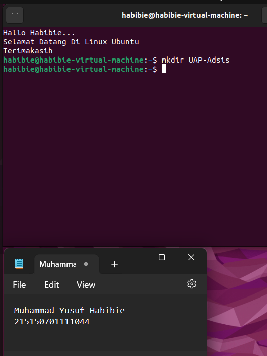
b. memb
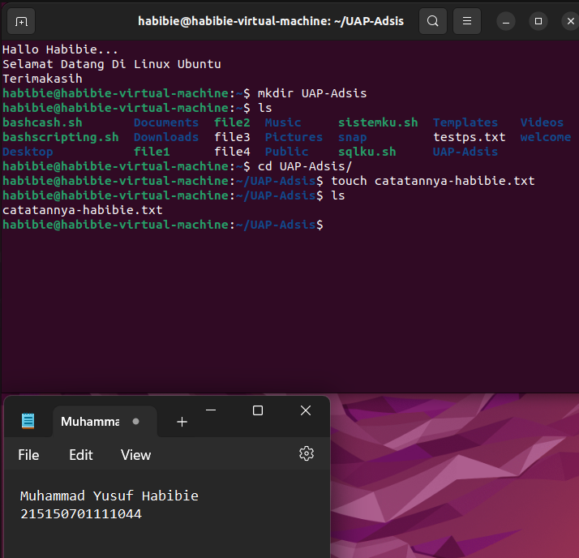
c. menu
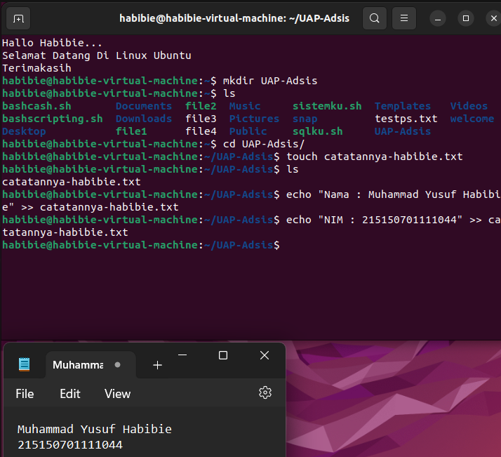
d. meng
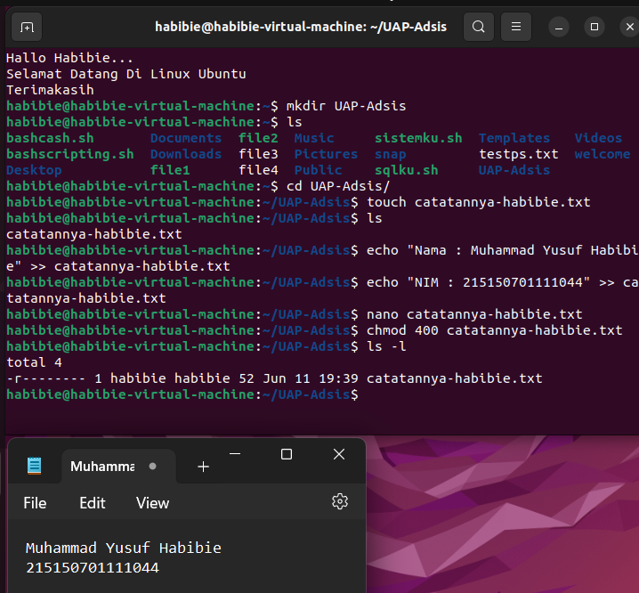
e. bukt
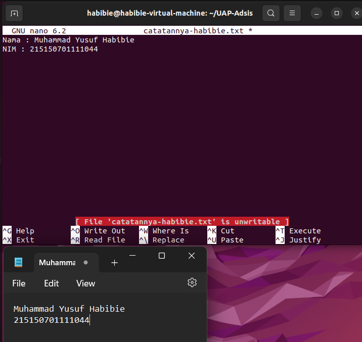

2. Lakukan konfigurasi alamat IP address sementara pada sistem dan default gateway. (petunjuk 192.168.56.x | x adalah nomor absen)
a. aa
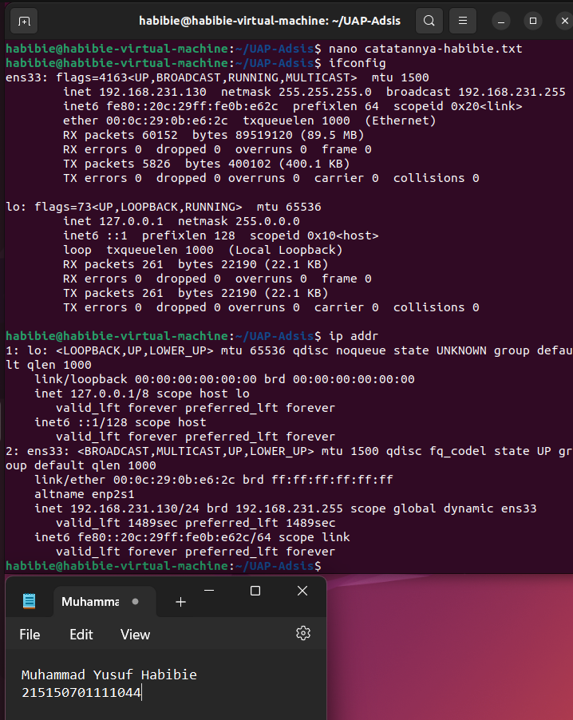
b. bb
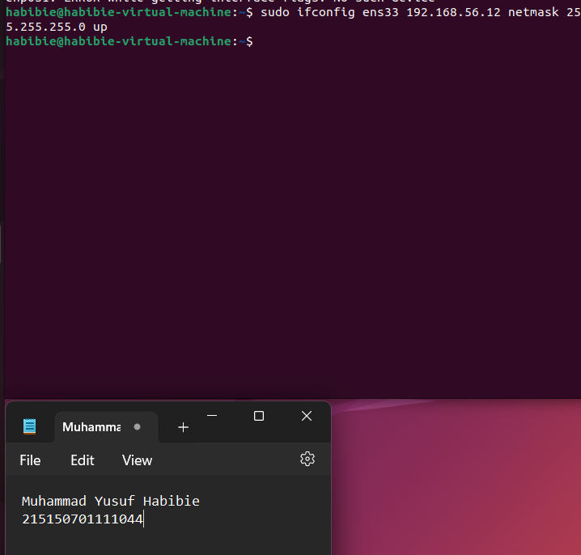
c. 
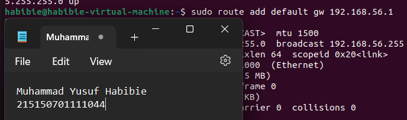
d. 
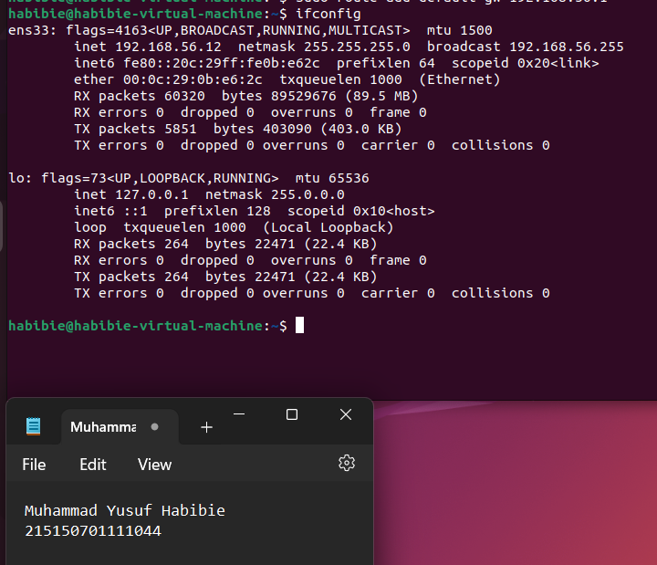

3. Lakukan Instalasi Webmin lalu buatlah user bernama nama anda, lalu buat group Adsis_(kelas masing-masing) dan masukkan nama anda di group!
a.
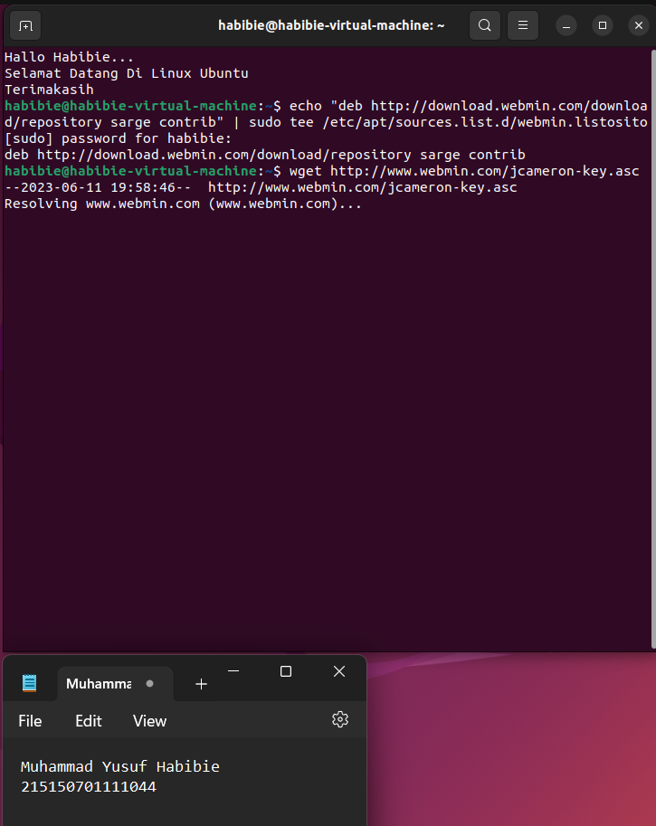
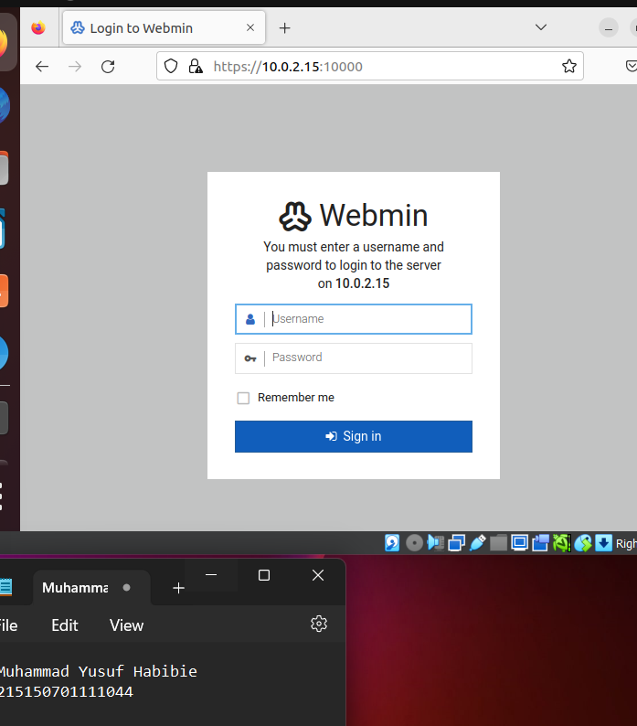
b.
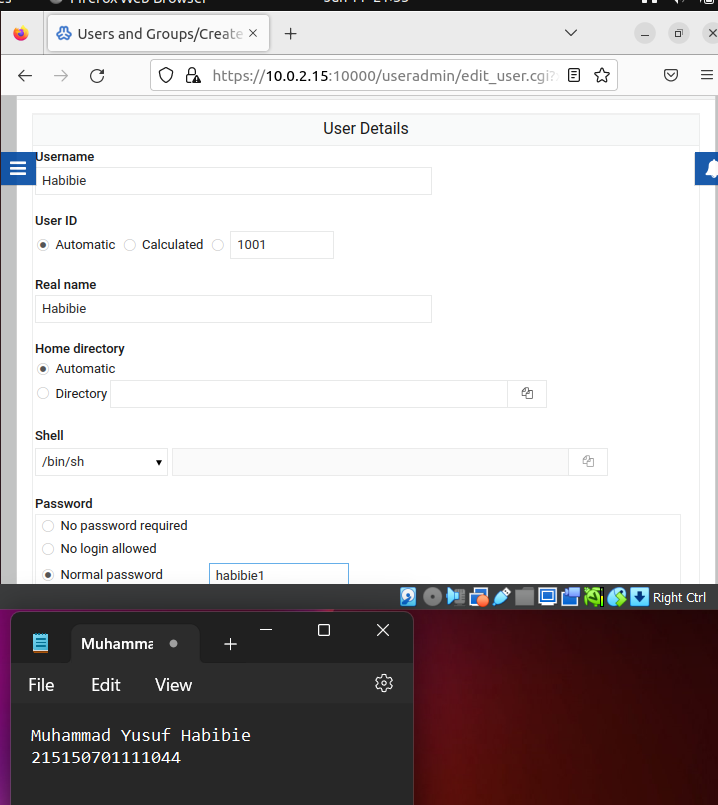
c.

d.
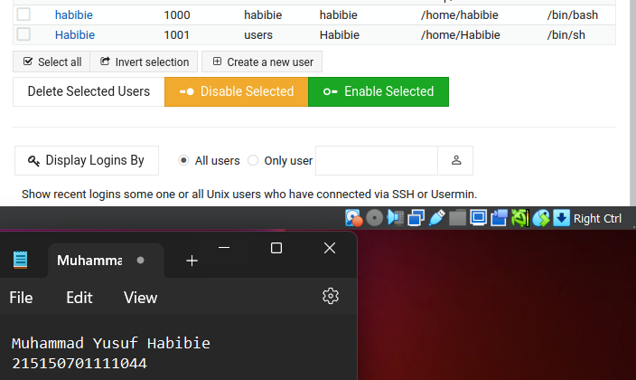
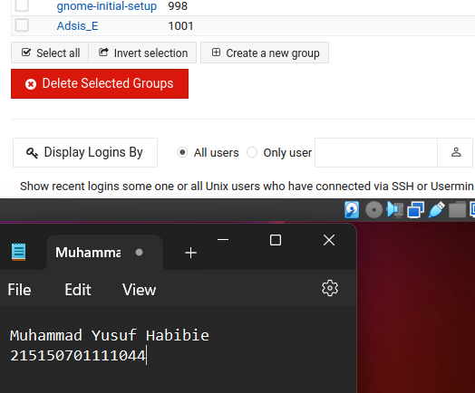

4. Lakukan ping ke alamat ip anda
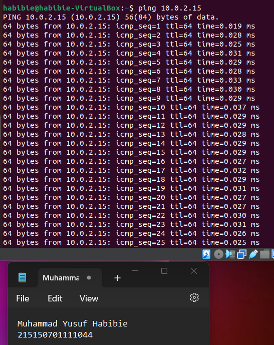

5. Buatlah perintah otomatis yang berfungsi untuk ping www.filkom.ub.ac.id
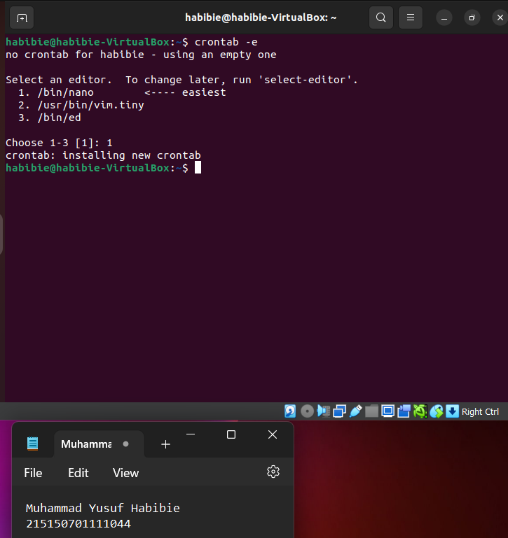
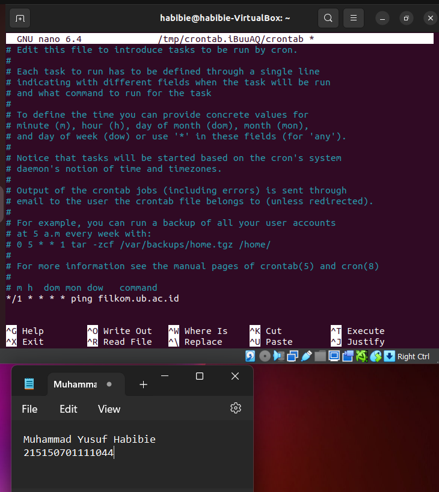
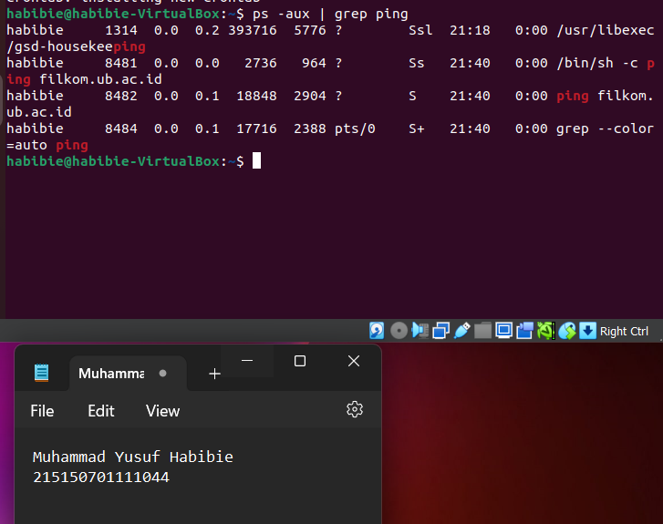
