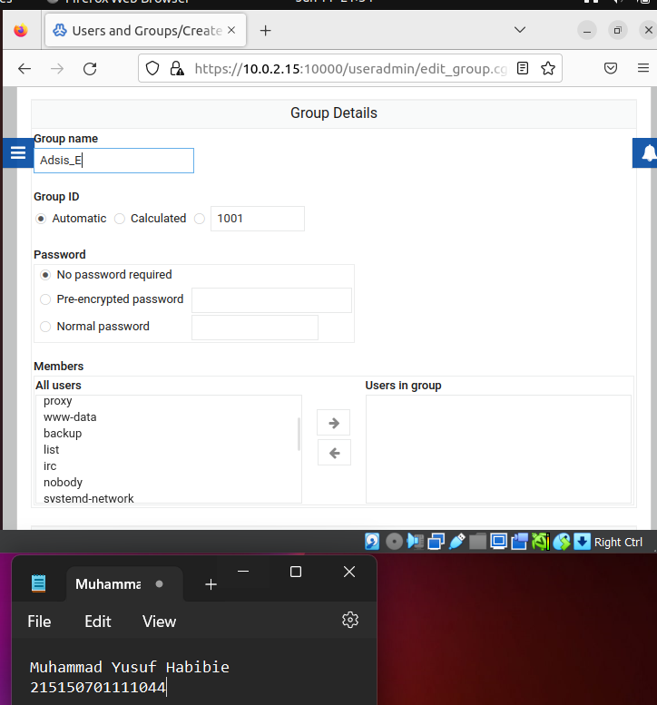

UAP Berbasis Portofolio
Nama : Muhammad Yusuf Habibie
NIM  : 215150701111044

1. Buat direktori dengan nama UAP-Adsis, isi dengan file txt dengan format penamaan catatannya-nama kamu.txt, kemudian isi file txt tersebut dengan nama dan NIM kamu. Kemudian atur permission view-only pada file tersebut untuk user biasa. Tunjukkan bukti berupa screenshot yang menunjukkan bahwa file tersebut berhasil diatur permissionnya menjadi view-only untuk user biasa.

a. Membuat direktori dengan nama UAP-Adsis

b. Membuat file dengan nama catatanya-habibie.txt

c. Menuliskan nama dan nim

d. Mengubah izin dari file catatannya-habibie.txt dalam mode view-only atau hanya bisa read oleh admin saja

e. Hasil

2. Lakukan konfigurasi alamat IP address sementara pada sistem dan default gateway. (petunjuk 192.168.56.x | x adalah nomor absen)

a. Konfigurasi ip address sebelumnya

b. Melakukan konfigurasi alamat IP address sementara dan default gateway pada sistem

c. Kemudian konfigurasi ip default gateway

d. Hasil

3. Lakukan Instalasi Webmin lalu buatlah user bernama nama anda, lalu buat group Adsis_(kelas masing-masing) dan masukkan nama anda di group!

a. Proses instalasi webmin

b. Membuat User baru

c. Membuat Group baru

d. Hasil

4. Lakukan ping ke alamat ip anda

5. Buatlah perintah otomatis yang berfungsi untuk ping www.filkom.ub.ac.id

a. Membuka tools crontab

b. Memasukkan perintah untuk ping filkom.ub.ac.id

c. Hasil

